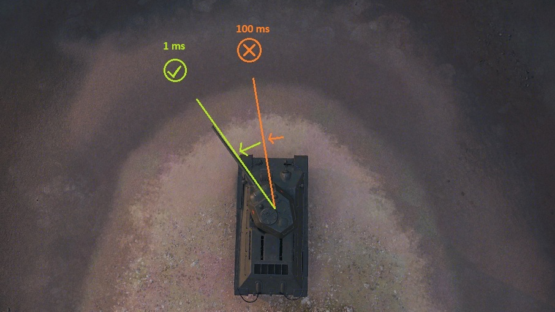

# Responsive Reticle
A mod for World of Tanks that increases client reticle tick rate
several dozen times.

Basically reducing client reticle input lag movement <ins>**from 100 ms (???)
to 1 ms**</ins>.

## Notes
* disabled for SPG because ... it's complicated
* disabled in replays

## Feedback
You can:
- PM me on discord: **fierioziy** (nick: **Pruszko \[EU\]** on [WoT official discord](https://discord.gg/world-of-tanks))
- in game on EU server: **Pruszko**
- or [GitHub issues here](https://github.com/Pruszko/ResponsiveReticle/issues).

## Download sites
Here are websites, where mod is uploaded directly by me:
* [WG Mods](https://wgmods.net/7413/)
* [GitHub release page](https://github.com/Pruszko/ResponsiveReticle/releases)

## Installation
Copy "pruszko.responsive_reticle_X.wotmod"
into "[WoT game directory]/mods/[version]/" directory
